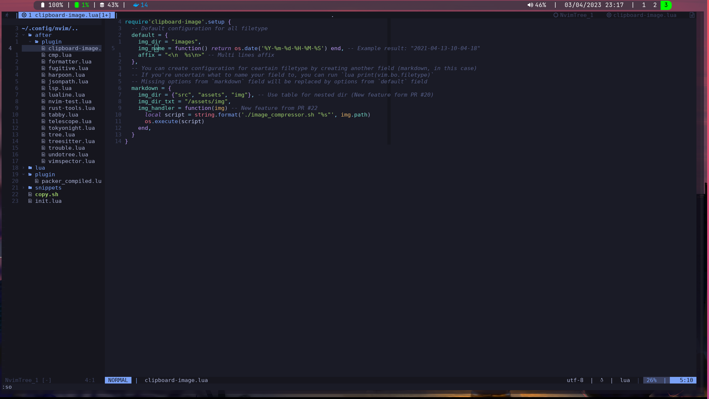

# Dotfiles

Dotfiles for my current linux workstation.

## Version Table

| Package Name | Version            |
| ------------ | ------------------ |
| Neovim       | 0.8.3              |
| i3           | 4.21.1-2-g59cdfc0f |
| rofi         | 1.7.1              |
| polybar      | 3.5.7              |

## Current Layout

## Use configuration files in this repo

Run `sync_config_with_repo.sh` script to automatically put configuration in the correct system folders.

