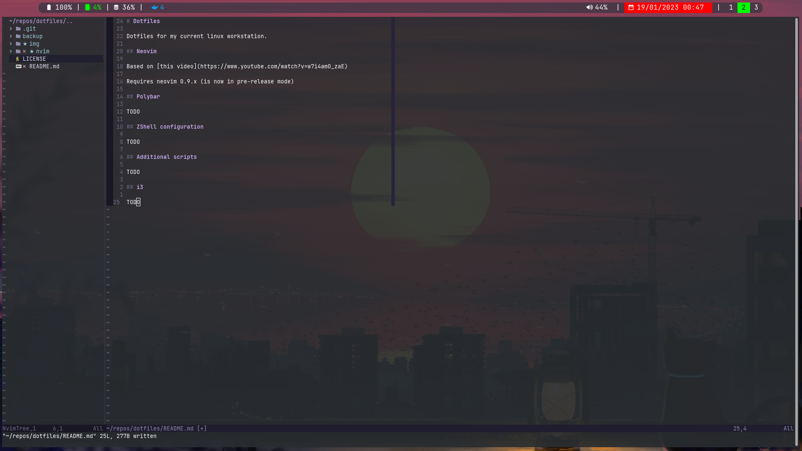

# Dotfiles

Dotfiles for my current linux workstation.

## Neovim

Based on [this video](https://www.youtube.com/watch?v=w7i4amO_zaE)

Requires neovim 0.9.x (is now in pre-release mode)

## Polybar

TODO

## ZShell configuration

TODO

## Additional scripts

TODO

## i3

TODO
